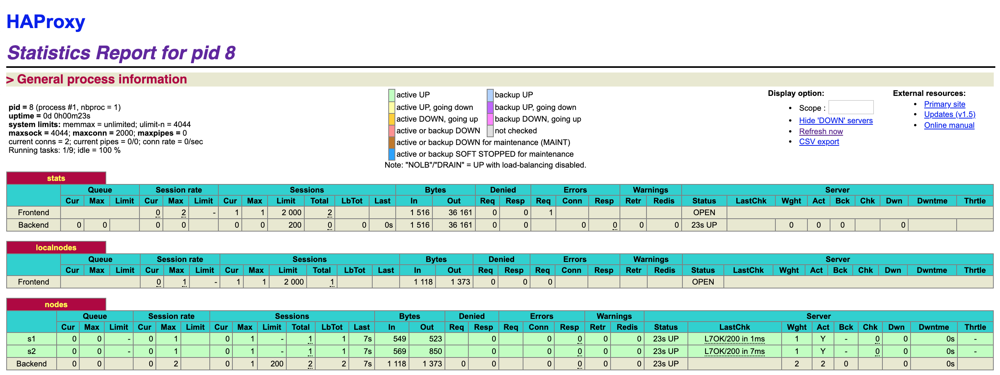
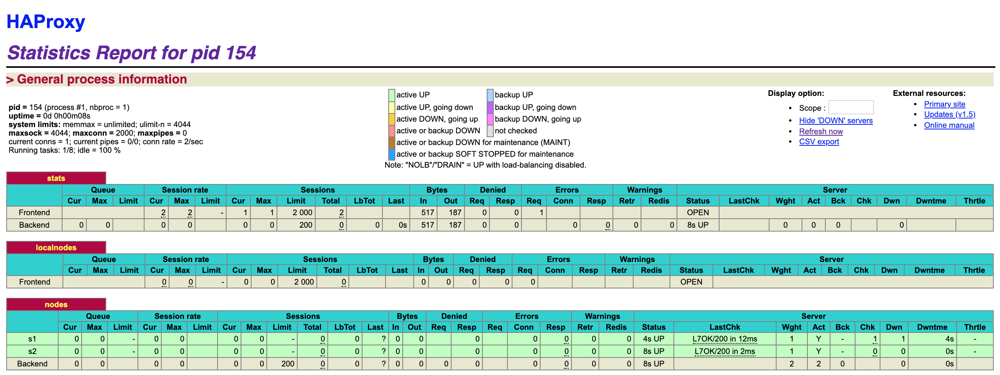

# Introduction


# Tasks

## Task 0: Identify issues and install the tools

> **[M1]** Do you think we can use the current solution for a production environment? What are the main problems when deploying it in a production environment?

Non, cette solution n'est pas adaptée à un environnement de production. En cas d'arrêt inopiné de *node*, aucun monitoring, ni procédure automatique n'est configurée. En cas de grande charge, aucune stratégie de *scaling* n'est définie. L'ajout de nouveau *container* est compliquée dans l'infrastructure courante (CF. **M2**).


> **[M2]** Describe what you need to do to add new `webapp` container to the infrastructure. Give the exact steps of what you have to do without modifiying the way the things are done. Hint: You probably have to modify some configuration and script files in a Docker image.

1. Ajouter les variables d'environnements correspondant à notre nouvelle *node* dans le fichier `.env` à la racine. Les variables d'environnements à ajouter sont les suivantes :

```
WEBAPP_3_NAME=s3
WEBAPP_3_IP=192.168.42.33
```

2. Modifier la configuration comme suit de *haproxy* dans le fichier `docker-compose.yml`.

```
  haproxy:
       container_name: ha
       build:
         context: ./ha
         dockerfile: Dockerfile
       ports:
         - 8080:80
         - 1936:1936
         - 9999:9999
       expose:
         - 80
         - 1936
         - 9999
       networks:
         heig:
           ipv4_address: ${HA_PROXY_IP}
       environment:
            - WEBAPP_1_IP=${WEBAPP_1_IP}
            - WEBAPP_2_IP=${WEBAPP_2_IP}
            - WEBAPP_3_IP=${WEBAPP_3_IP}
```

3. Ajouter une *webapp* dans le fichier `docker-compose.yml`.

```
  webapp3:
       container_name: ${WEBAPP_3_NAME}
       build:
         context: ./webapp
         dockerfile: Dockerfile
       networks:
         heig:
           ipv4_address: ${WEBAPP_3_IP}
       ports:
         - "4001:3000"
       environment:
            - TAG=${WEBAPP_3_NAME}
            - SERVER_IP=${WEBAPP_3_IP}
```

4. Ajouter une *node* dans le fichier de configuration de *haproxy*, `haproxy.cfg`, dans la section *backend nodes*.

```
# Define the backend configuration. In fact, that's the part that configure what is not directly
# accessible from the outside of the network.
# http://cbonte.github.io/haproxy-dconv/configuration-1.5.html#4
backend nodes
    # Define the protocol accepted
    # http://cbonte.github.io/haproxy-dconv/configuration-1.5.html#4-mode
    mode http

    # Define the way the backend nodes are checked to know if they are alive or down
    # http://cbonte.github.io/haproxy-dconv/configuration-1.5.html#4-option%20httpchk
    option httpchk HEAD /

    # Define the balancing policy
    # http://cbonte.github.io/haproxy-dconv/configuration-1.5.html#balance
    balance roundrobin

    # Automatically add the X-Forwarded-For header
    # http://cbonte.github.io/haproxy-dconv/configuration-1.5.html#4-option%20forwardfor
    # https://en.wikipedia.org/wiki/X-Forwarded-For
    option forwardfor

    # With this config, we add the header X-Forwarded-Port
    # http://cbonte.github.io/haproxy-dconv/configuration-1.5.html#4-http-request
    http-request set-header X-Forwarded-Port %[dst_port]

    # Define the list of nodes to be in the balancing mechanism
    # http://cbonte.github.io/haproxy-dconv/configuration-1.5.html#4-server
    server s1 ${WEBAPP_1_IP}:3000 check
    server s2 ${WEBAPP_2_IP}:3000 check
    server s3 ${WEBAPP_3_IP}:3000 check
```


> **[M3]** Based on your previous answers, you have detected some issues in the current solution. Now propose a better approach at a high level.

Une meilleure solution serai de surveiller les *container* de type `webapp` et de les ajouter / retirer de manière dynamique du *load balancer*.


> **[M4]** You probably noticed that the list of web application nodes is hardcoded in the load balancer configuration. How can we manage the web app nodes in a more dynamic fashion?

Il est possible de gérer dynamiquement les *web app nodes* de manière plus dynamique en générant le fichier de configuration du *load balancer* au démarrage, ainsi que lorsqu'une application disparaît ou disparaît dans le *pool* d'applications. Le *pool* d'applications pourrait être géré de différente manière en surveillant l'activité des *containers* qui peuvent par exemple s'enregistrer ou sortir du *pool*.


> **[M5]** In the physical or virtual machines of a typical infrastructure we tend to have not only one main process (like the web server or the load balancer) running, but a few additional processes on the side to perform management tasks.
>
> For example to monitor the distributed system as a whole it is common to collect in one centralized place all the logs produced by the different machines. Therefore we need a process running on each machine that will forward the logs to the central place. (We could also imagine a central tool that reaches out to each machine to gather the logs. That's a push vs. pull problem.) It is quite common to see a push mechanism used for this kind of task.
>
> Do you think our current solution is able to run additional management processes beside the main web server / load balancer process in a container? If no, what is missing / required to reach the goal? If yes, how to proceed to run for example a log forwarding process?

Pour pouvoir lancer plusieurs processus sur une même *container* `docker`, il est possible de procéder de différentes manière[^1], un approche privilégie l'utilisation de script à lancer lors du lancement du *container* avec la commande `CMD` de `docker` dans le *Dockerfile*. Une autre approche possible est de lancer un *process manager* comme processus principal de notre *container* et c'est lui qui s'occupera de lancer nos autre processus, par exemple la docummantation `docker` propose l'utilisation de `supervisord`.

[^1]: https://docs.docker.com/config/containers/multi-service_container/


> **[M6]** In our current solution, although the load balancer configuration is changing dynamically, it doesn't follow dynamically the configuration of our distributed system when web servers are added or removed. If we take a closer look at the `run.sh` script, we see two calls to `sed` which will replace two lines in the `haproxy.cfg` configuration file just before we start `haproxy`. You clearly see that the configuration file has two lines and the script will replace these two lines.
>
> What happens if we add more web server nodes? Do you think it is really dynamic? It's far away from being a dynamic configuration. Can you propose a solution to solve this?

Non, ce n'est pas dynamique, si l'on ajoute de nouvelle *nodes* il est tout de même nécessaire de modifier le script ainsi que de redémarrer le *container* du *load balancer*. Une meilleure solution est d'implémenter un mécanisme de surveillance des *container* "up" et de régénérer dynamiquement la configuration du *load balancer* sans avoir à le redémarer.


**Deliverables**

> 1. Take a screenshot of the stats page of HAProxy at [http://192.168.42.42:1936](http://192.168.42.42:1936/). You should see your backend nodes.



> 2. Give the URL of your repository URL in the lab report.

https://github.com/nathanseville/Teaching-HEIGVD-AIT-2019-Labo-Docker


## Task 1: Add a process supervisor to run several processes

**Deliverables**

> 1. Take a screenshot of the stats page of HAProxy at [http://192.168.42.42:1936](http://192.168.42.42:1936/). You should see your backend nodes. It should be really similar to the screenshot of the previous task.




> 2. Describe your difficulties for this task and your understanding of what is happening during this task. Explain in your own words why are we installing a process supervisor. Do not hesitate to do more research and to find more articles on that topic to illustrate the problem.

L'installation d'un *process supervisor* tel que `S6` va nous permettre de lancer plusieurs processus par *container* `docker`, c'est important qu'on puisse le faire afin de pouvoir ajouter par exemple un processus qui communique sur l'état de la *node* pour pouvoir les manager correctement en fonction de leur état.

Notre *process supervisor* nous permet d'éviter que notre *container* `docker` s'arrête si l'application web tombe.


## Task 2: Add a tool to manage membership in the web server cluster

> 1. Provide the docker log output for each of the containers: `ha`, `s1` and `s2`. You need to create a folder `logs` in your repository to store the files separately from the lab report. For each lab task create a folder and name it using the task number. No need to create a folder when there are no logs.

Les logs sont dans le dossier `logs` à la racine du git.


> 2. Give the answer to the question about the existing problem with the current solution.

Le problème c'est que notre `Serf` sur le HAProxy ne prend pas en charge la gestion des membres des autres *containers*.


> 3. Give an explanation on how `Serf` is working. Read the official website to get more details about the `GOSSIP` protocol used in `Serf`. Try to find other solutions that can be used to solve similar situations where we need some auto-discovery mechanism.

Le `GOSSIP` protocole est principalement basé sur le protocole `SWIM`, il permet de propager l'information rapidement en broadcastant à tout ses voisins son état actuel.Le protocole se base essentiellement sur `UDP` pour accomplir sa tâche. La détection de *node* "down" se fait en trois étapes, les nodes effectuent des vérifications régulièrement pour savoir si leur voisin sont toujours "up" à l'aide de simple requête avec demande d'un `ACK`. (1) Si la *node* ne répond pas on demande à nos voisin d'effectuer la même requête, (2) si la *node* ne répond pas elle est marquée comme suspicieuse et l'information est *broadcatsée* au autre *node*, (3) si la node ne répond toujours pas après un intervalle de temps configurable elle est considérée comme "down" et son état est *broadcasté*.

Une alternative serait de privilégier une méthode de type *pull*, un *manager* principal serait seul responsable de vérifier qu'il n'y ait pas de nouvelle *node* où des *nodes* en moins en effectuant un scan du réseau pour la détection de nouvelle *node* et en gardant l'état du *pool* de *node* afin de les interroger régulièrement pour vérifier qu'elles soient toujours "up".


## Task 3: React to membership changes

> 1. Provide the docker log output for each of the containers: `ha`, `s1` and `s2`. Put your logs in the `logs` directory you created in the previous task.

Tout est dans le dossier `logs` à la racine du git.


> 2. Provide the logs from the `ha` container gathered directly from the `/var/log/serf.log` file present in the container. Put the logs in the `logs` directory in your repo.

Tout est dans le dossier `logs` à la racine du git.


## Task 4: Use a template engine to easily generate configuration files

> 1. You probably noticed when we added `xz-utils`, we have to rebuild the whole image which took some time. What can we do to mitigate that? Take a look at the Docker documentation on [image layers](https://docs.docker.com/engine/userguide/storagedriver/imagesandcontainers/#images-and-layers). Tell us about the pros and cons to merge as much as possible of the command.

Chaque commande (ligne) dans le docker file est considéré comme un "layer". Si le "layer" est modifié, ce "layer" ainsi que tous les suivants sont "rebuild". Si plusieurs commandes sont sur la même ligne, elle sera entièrement re-exécutée même s'il n'y a qu'un paquet qui est ajouté. Une solution est donc de placer une commande par ligne en ajoutant la nouvelle ligne à la fin. Cela permet de conserver les layers précédents. Il faut cependant faire attention à la commande `update` qui devrait être re-exécutées afin d'obtenir des paquets à jour.

```dockerfile
# Tout est réinstallé
RUN apt-get update && apt-get -y install wget curl vim iputils-ping rsyslog xz-utils
```

```dockerfile
# Ici la ligne n'est pas pas reexecutée
RUN apt-get update && apt-get -y install wget curl vim iputils-ping rsyslog

# Seule ce layer et les suivants sont construits, le update est important car on ne sais pas quand la ligne précédente à été executée.
RUN apt-get update && apt-get -y install xz-utils
```


> 2. Propose a different approach to architecture our images to be able to reuse as much as possible what we have done. Your proposition should also try to avoid as much as possible repetitions between your images.

Une meilleure approche est de chainer les images, une image de base avec `S6` et les instructions commune puis chaque nouvelle image différente demandant quelques instructions supplémentaires basée sur celle possédant les instructions commune à l'aide de la commande `FROM <image>`, ceci permet de limiter la taille des containers et images comme chaque nouvelle image partagera les *layers* de base avec les autre.


> 3. Provide the `/tmp/haproxy.cfg` file generated in the `ha` container after each step. Place the output into the `logs` folder like you already did for the Docker logs in the previous tasks. Three files are expected.
>
> In addition, provide a log file containing the output of the `docker ps` console and another file (per container) with `docker inspect `. Four files are expected.

Dans le dossier `logs` à la racine du git.


> 4. Based on the three output files you have collected, what can you say about the way we generate it? What is the problem if any?

//// TO COMPLETE


## Task 5: Generate a new load balancer configuration when membership changes

> 1. Provide the file `/usr/local/etc/haproxy/haproxy.cfg` generated in the `ha` container after each step. Three files are expected.
>
>    In addition, provide a log file containing the output of the `docker ps` console and another file (per container) with `docker inspect `. Four files are expected.

Dans le dossier `logs` à la racine du git.


> 2. Provide the list of files from the `/nodes` folder inside the `ha` container. One file expected with the command output.

Dans le dossier `logs` à la racine du git.


> 3. Provide the configuration file after you stopped one container and the list of nodes present in the `/nodes` folder. One file expected with the command output. Two files are expected.
>
> In addition, provide a log file containing the output of the `docker ps` console. One file expected.

Dans le dossier `logs` à la racine du git.


> 4. (Optional:) Propose a different approach to manage the list of backend nodes. You do not need to implement it. You can also propose your own tools or the ones you discovered online. In that case, do not forget to cite your references.

//// TO COMPLETE

## Task 6: Make the load balancer automatically reload the new configuration

> 1. Take a screenshots of the HAProxy stat page showing more than 2 web applications running. Additional screenshots are welcome to see a sequence of experimentations like shutting down a node and starting more nodes.
>
>    Also provide the output of `docker ps` in a log file. At least one file is expected. You can provide one output per step of your experimentation according to your screenshots.

Tout dans le dossier `logs` à la racine du git.


> 2. Give your own feelings about the final solution. Propose improvements or ways to do the things differently. If any, provide references to your readings for the improvements.

Tout dans le dossier `logs` à la racine du git.


> 3. (Optional:) Present a live demo where you add and remove a backend container.

///// TO COMPLETE


# Difficulties


# Conclusion

